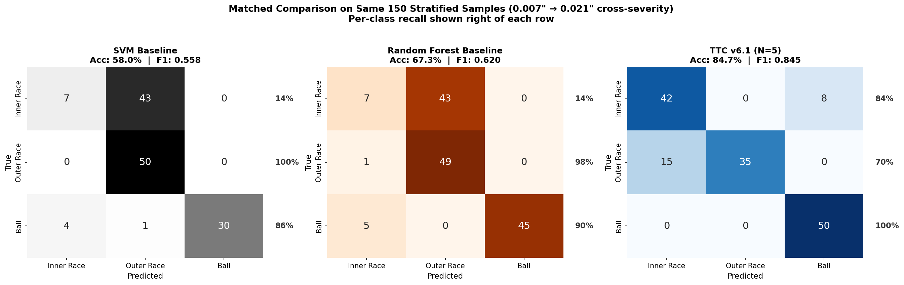
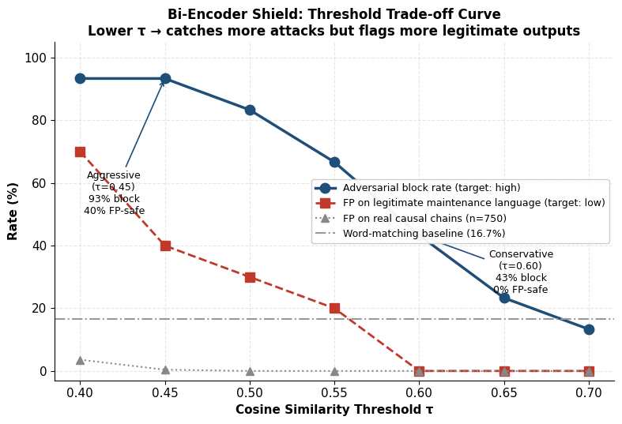
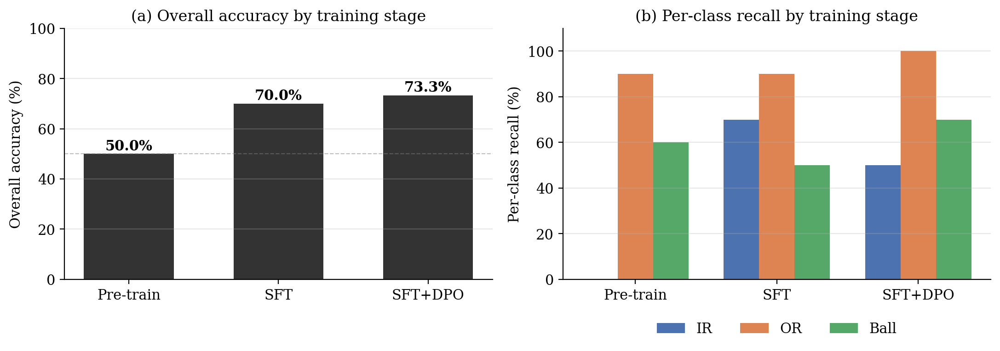
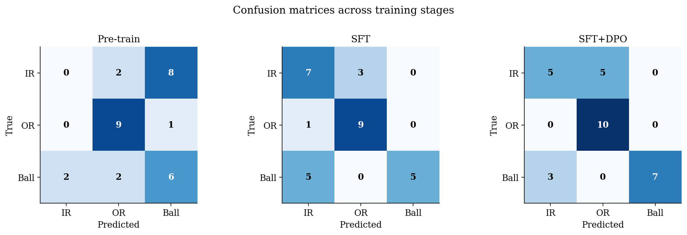
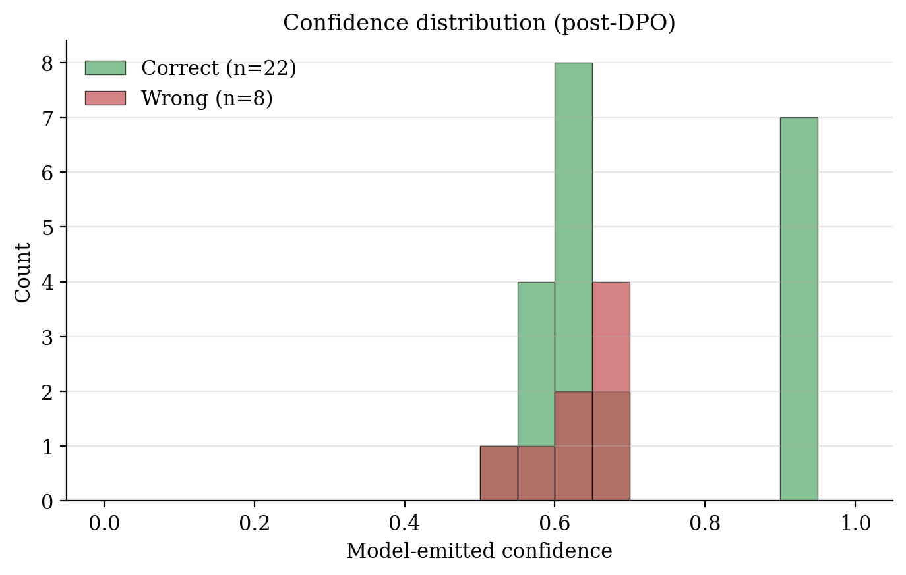
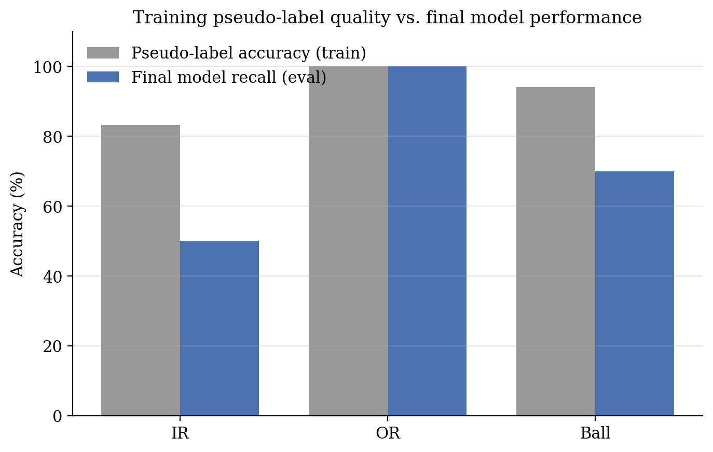

# Test-Time Compute and Semantic Safety Filtering for Industrial Fault Attribution

> **IEEE IES Generative AI Hackathon 2026** — Cross-severity bearing fault attribution using LLM reasoning, paired with a semantic safety shield. Includes a preliminary small-model adaptation study (LoRA-SFT + DPO on Qwen 2.5-0.5B).

[](https://www.python.org/downloads/)
[](https://opensource.org/licenses/MIT)
[]()

**Authors:** Mohamed Alwathiq Ali, Moaz Jalal — Universiti Teknologi Malaysia


---

## TL;DR

We construct a load-matched cross-severity benchmark on the CWRU bearing dataset and demonstrate three findings:

1. **Classical baselines collapse on Inner Race recall** (11–26%) when tested at 0.021-inch severity after training on 0.007-inch. This is a feature-distribution problem, not a classifier-choice problem — SVM, Random Forest, and KNN all fail in the same direction on the same class.
2. **Test-Time Compute with self-consistency reaches 84.7% accuracy** (+17.3 pp over Random Forest), recovering Inner Race recall from 14% → 84% by treating severity-invariant time-domain features (RMS, kurtosis) as primary discriminators.
3. **A sentence-transformer bi-encoder safety shield blocks 93.3% of adversarial unsafe recommendations** versus 16.7% for regex word-matching, including paraphrased and obfuscated attacks, at a 0.4% false-positive rate on real outputs.

A small-model adaptation study (Qwen 2.5-0.5B + LoRA-SFT + DPO) is reported as a **preliminary observation**, not a reliability claim — see [Section 6](#6-ttrl-style-small-model-adaptation-preliminary-experiment) for the full story including what worked, what didn't, and why.

---

## Table of Contents

1. [Motivation: Why Cross-Severity Matters](#1-motivation-why-cross-severity-matters)
2. [Framework Architecture](#2-framework-architecture)
3. [Dataset and Benchmark Design](#3-dataset-and-benchmark-design)
4. [Test-Time Compute (TTC) Results](#4-test-time-compute-ttc-results)
5. [Semantic Safety Shield](#5-semantic-safety-shield)
6. [TTRL-Style Small-Model Adaptation (Preliminary Experiment)](#6-ttrl-style-small-model-adaptation-preliminary-experiment)
7. [Methodological Pitfalls We Encountered](#7-methodological-pitfalls-we-encountered)
8. [Repository Structure](#8-repository-structure)
9. [Reproducibility](#9-reproducibility)
10. [Citation](#10-citation)

---

## 1. Motivation: Why Cross-Severity Matters

Industrial bearing-fault diagnosis is dominated by results obtained under **matched-severity** evaluation: a model trained on early-stage faults is tested on early-stage faults, and a model trained on advanced faults is tested on advanced faults. This evaluation design hides the failure mode that matters most in deployment — degradation as fault severity progresses past the training distribution.

Our benchmark trains classifiers on 0.007-inch (incipient) faults and tests on 0.021-inch (advanced) faults of the same fault types, with motor load held constant. Under this protocol:

- All three classical baselines (SVM, Random Forest, KNN) lose 33–40 percentage points relative to matched-severity accuracy.
- **Inner Race recall collapses to 11–26% across all three classifiers** despite differing inductive biases.
- 210 of 237 IR samples (88.6%) are misrouted to the Outer Race class by both SVM and Random Forest.

That all three classifiers fail in the same direction and on the same class indicates that the failure is a property of the feature distribution rather than of any particular classifier choice.


*All baselines collapse on Inner Race at 0.021-inch severity. The IR→OR misrouting pattern is shared across SVM, Random Forest, and KNN.*

The kurtosis distribution shift below shows the feature-level signature of this failure:


*Inner Race kurtosis shifts from a tight mode near 2 at training severity to a broad distribution centred near 4 at test severity. The classical decision boundary, calibrated to training-severity geometry, simply does not extend to the test-severity distribution for IR.*

---

## 2. Framework Architecture

The framework is a four-stage inference pipeline:

![Framework block diagram]

1. **Feature Extraction:** 1024-sample windows → 20-dim feature vector (8 time-domain + 4 raw-spectrum + 8 envelope-spectrum band amplitudes) using Smith & Randall Method 1.
2. **Classical Prior:** Random Forest classifier trained on 0.007-inch features.
3. **TTC Causal Attribution:** $N$ independent reasoning chains from Llama-3.1-8B over a 4-rule decision system. Majority voting determines the final attribution.
4. **Semantic Safety Shield:** Bi-encoder (all-mpnet-base-v2) compares the natural-language recommendation against 36 unsafe-action templates; recommendations crossing a cosine-similarity threshold are blocked.

### The 4-Rule Decision System

The TTC prompt encodes a small rule system grounded in empirical class statistics at advanced severity. **Rules treat severity-invariant time-domain features (RMS, kurtosis) as primary discriminators**, with spectral ratios reserved for boundary cases:

| Rule | Condition | Class |
|------|-----------|-------|
| 1 | RMS < 0.25 | Ball |
| 2 | kurtosis < 9 | Inner Race |
| 3 | kurtosis > 10 | Outer Race |
| 4 | kurtosis ∈ [9, 10] AND BPFI/BPFO > 1.0 | Inner Race (else Outer Race) |

The model must either confirm the classifier prior or override it; an override is required to cite the specific feature value triggering a different rule.

---

## 3. Dataset and Benchmark Design

CWRU Bearing Dataset, drive-end accelerometer signals at 12 kHz from an SKF 6205-2RS bearing.

- **Track A (matched severity):** 0.007-inch faults at 0 HP load. Files: 97.mat, 105.mat, 118.mat, 130.mat.
- **Track B (cross-severity):** 0.021-inch faults at 0 HP load. Files: 209.mat, 222.mat, 234.mat. (Normal class unavailable at this severity.)

Both tracks are at 0 HP — load is held constant; severity is the only varying factor.

**Segmentation:** 1024-sample windows with 50% overlap. 712 fault-only segments at Track B.

**Stratified evaluation set:** For computationally expensive LLM evaluations, a 150-sample stratified pool (50 per class) is drawn from Track B. Statistical equivalence to the full 712-sample evaluation is supported by the high overlap-induced correlation between adjacent segments.

---

## 4. Test-Time Compute (TTC) Results

### Headline Numbers (150-sample stratified Track B)

| Method | Accuracy | F1 macro | Δ vs RF |
|--------|----------|----------|---------|
| Ratio rule (BPFI/BPFO) | 50.8% | 0.50 | −16.5 pp |
| SVM (RBF) | 58.0% | 0.56 | −9.3 pp |
| Random Forest | 67.3% | 0.62 | — |
| TTC v6.1, N=1 | 78.7% | 0.78 | +11.4 pp |
| TTC v6.1, N=3 | 83.3% | 0.83 | +16.0 pp |
| **TTC v6.1, N=5** | **84.7%** | **0.845** | **+17.4 pp** |



*SVM and Random Forest both misroute the majority of Inner Race samples to Outer Race. TTC recovers 42 of 50 Inner Race samples but loses 15 Outer Race samples to the Inner Race class — a redistribution rather than uniform improvement.*

### Per-Class Breakdown

| Class | SVM | Random Forest | TTC (N=5) | Δ vs RF |
|-------|-----|---------------|-----------|---------|
| Inner Race | 14% | 14% | **84%** | **+70 pp** |
| Outer Race | 100% | 98% | 70% | −28 pp |
| Ball | 86% | 90% | 100% | +10 pp |

### Override Behaviour

At N=5, the LLM overrides the Random Forest prior on 82 of 150 samples (54.7%), with 59 of those overrides correct → **override precision of 72.0%**. Override precision rises monotonically with N (63.9% → 70.7% → 72.0%), confirming that majority voting concentrates probability mass on the correct decision rather than reinforcing a deterministic shortcut.

### Qualitative Reasoning Chains

The reasoning chains explicitly cite the feature value triggering each rule:

```
[True: Inner Race; Random Forest prior: Outer Race; TTC: Inner Race]
"Rule 2 fired due to kurtosis = 5.67 < 9, which triggered the
 Inner Race classification." (confidence 0.6)

[True: Outer Race; Random Forest prior: Outer Race; TTC: Outer Race]
"Rule 1 did not fire (RMS = 0.555 > 0.25); Rule 2 fired because
 kurtosis = 16.42 > 10, classifying as Outer Race." (confidence 0.6)
```

Cases where TTC errs typically involve boundary kurtosis values in the [9, 10] range, where Rule 4 falls back to a less reliable spectral tiebreaker.

### The Important Caveat

**TTC trades 28 points of Outer Race recall for 70 points of Inner Race recall.** This is a redistribution of errors, not a uniform improvement. The favourable side of the trade is that Inner Race was the previously uncorrectable bottleneck shared across all classical baselines — a class no choice of classical classifier could correct. But TTC and classical baselines are not interchangeable: their failure modes are *complementary*, and a production system requiring high recall on all classes should consider ensembling rather than substitution.

We confirmed this prompt-dependence empirically: an earlier prompt variant with an Inner-Race-recovery anchor caused the *opposite* failure, misclassifying clear Ball samples as Inner Race despite conflicting features. The error distribution is a property of the prompt, not of LLMs in general.

---

## 5. Semantic Safety Shield

### Setup

Three test sets:

- **30 adversarial unsafe maintenance recommendations** across three difficulty tiers (10 each):
  - **Direct:** literal unsafe phrasing (`"continue operation despite the fault"`)
  - **Paraphrased:** semantically equivalent rewordings (`"operational continuity is preserved given the marginal nature of the observed deviations"`)
  - **Obfuscated:** heavy hedging (`"Bayesian updating against the prior of nominal bearing health does not yield a posterior sufficiently shifted"`)
- **10 safe negative-control recommendations** (e.g., `"schedule immediate inspection"`)
- **750 real reasoning chains** from the TTC cache (5 chains × 150 samples)

### Results



*Threshold trade-off curve. Lower τ catches more adversarial cases but flags more legitimate maintenance language as unsafe.*

| Shield | Direct | Paraphrased | Obfuscated | Total adversarial | FP (real) |
|--------|--------|-------------|------------|-------------------|-----------|
| Word-matching (15 regex) | 50% | 0% | 0% | 16.7% | 0.0% |
| Bi-encoder, τ=0.60 | 60% | 50% | 20% | 43.3% | 0.0% |
| **Bi-encoder, τ=0.45** | **100%** | **90%** | **90%** | **93.3%** | **0.4%** |

The bi-encoder at τ=0.45 catches 28 of 30 adversarial cases — an improvement of 76.6 percentage points over word-matching — at a 0.4% false-positive rate on real reasoning chains.

### An Honest Note on the False-Positive Rate

At τ=0.45, the bi-encoder flags **4 of 10 legitimate diagnostic outputs** as unsafe. The flagged cases are action-oriented recommendations semantically adjacent to unsafe-action templates: `"stop the machine immediately"` and `"schedule maintenance within 48 hours"`.

Whether this is a defect or a feature depends on the deployment context. In an industrial system where any maintenance action affects equipment uptime, surfacing all action-oriented recommendations for human review is the conservative behaviour. We report the number openly rather than tuning τ to mask it.

The bi-encoder additionally identifies *which* of the four unsafe-intent categories is present in 96.7% of cases, confirming that the embedding model encodes intent correctly and that the threshold-based decision rule, not the encoder, is the operating-point bottleneck.

---

## 6. TTRL-Style Small-Model Adaptation (Preliminary Experiment)

> **Honest framing upfront:** This section reports a preliminary single-run experiment that is *not* part of the paper's headline contributions. The held-out set is too small for confidence intervals (30 samples), no replication across seeds was performed, and resource constraints during the hackathon evaluation window prevented systematic ablation. We report it here for completeness and as motivation for follow-up work.

### Goal

Test whether the framework's outputs can be distilled into a smaller deployable model — specifically, whether consensus-pseudo-labels from the TTC cache can be used to train a 0.5-billion-parameter model toward similar attribution behaviour.

### Setup

- **Base model:** Qwen 2.5-0.5B-Instruct (fp16 on a single T4 GPU)
- **Adaptation:** LoRA on attention + MLP projections (rank 8, alpha 16, dropout 0.05) → 4.4M trainable parameters (0.88% of base)
- **Training data:** 111 oversampled records (37 per class) from the 150-sample TTC cache, after filtering to 4-of-5 chain consensus and average confidence ≥ 0.5
- **Held-out evaluation:** 30 samples (10 per class), disjoint from training records
- **Stages:** Supervised fine-tuning (SFT) followed by direct preference optimization (DPO) on 43 preference pairs

### Final Results (single run)

| Stage | Accuracy | IR recall | OR recall | Ball recall |
|-------|----------|-----------|-----------|-------------|
| Pre-train (Qwen-0.5B base) | 50.0% | 0% | 90% | 60% |
| + SFT (LoRA) | 70.0% | 70% | 90% | 50% |
| **+ DPO** | **73.3%** | 50% | 100% | 70% |



*Overall accuracy and per-class recall across the three training stages.*



*Confusion matrices on the 30-sample held-out set. SFT recovers Inner Race recall from 0% to 70%; DPO trades some IR recall back to OR for cleaner overall calibration.*

### What I Actually Did and What I Learned

**Run 1 (chain-based training, poisoned chains in targets):**
- IR recall: 10%, OR: 100%, Ball: 100%, Overall: 70%
- IR completely failed; the model cited "Rule 2" as justification for predicting OR
- *This is where I discovered the chain poisoning issue — see below.*

**Run 2 (chain-stripped — output target was just `{fault, confidence}`):**
- IR: 80%, OR: 60%, Ball: 100%, Overall: 80%
- IR recovered, but OR collapsed
- Confidence values were nearly constant (0.55–0.60) — the model was emitting a memorized template, not per-sample reasoning

**Run 3 (reasoning-first ordering with deterministic chains, single phase):**
- IR: 0%, OR: 10%, Ball: 100%, Overall: 36.7%
- Catastrophic regression — Ball mode-collapsed (29/30 predictions Ball)
- Loss curve was healthy (0.86 → 0.10), but the model was overfitting to the memorized format

**Run 4 (same config as Run 3, but trained twice without kernel restart — accidentally a two-phase 56-step run):**
- IR: 70%, OR: 90%, Ball: 50%, Overall: 70%
- Genuine rule-application emerged — model output `"Kurtosis=10.97 > 10, Rule 3 fires → Outer Race"`
- One arithmetic-error case: `"Kurtosis=12.04 ≤ 9, Rule 2 fires → Inner Race"` — boundary failure mode of a 0.5B-parameter model

**Run 5 (DPO on top of Run 4):**
- IR: 50%, OR: 100%, Ball: 70%, Overall: 73.3%
- DPO traded IR (70→50) for OR (90→100) and Ball (50→70)
- Confidence values now varied, with high-confidence cluster at 0.9 all being correct (7/7)



*Post-DPO confidence distribution. High-confidence (0.9) predictions are 100% correct (7/7); mid-confidence (0.5–0.7) predictions show no clear correct/wrong separation.*

### The Chain-Poisoning Discovery

The most interesting methodological finding from this experiment was that **the teacher LLM (Llama-3.1-8B) produced reasoning chains that contradicted their own consensus labels in approximately 10% of cases**. Examples found in actual training data:

```
kurtosis = 12.63, label = Inner Race,
chain: "Rule 2 fired. Kurtosis=12.63 triggers Rule 2 → Inner Race"
       (kurtosis=12.63 should be Outer Race per Rule 3)

kurtosis = 14.63, label = Inner Race,
chain: "Rule 2 fired due to kurtosis=14.63 > 10"
       (Rule 2 is kurtosis < 9, not > 10)

kurtosis = 19.81, label = Inner Race,
chain: "Rule 2 fired due to kurtosis=19.81 > 10, which triggers Outer Race"
       (the chain literally contradicts itself)
```

These chains survived the 4-of-5 consensus filter because all five chains agreed on the (wrong) answer. Training the small model on these chains taught it incorrect *rule applications*, not just incorrect answers — when shown a feature value at inference, the model would reproduce the poisoned rule logic and arrive at the wrong class even when it had learned the correct label.

**The fix:** Strip reasoning chains from training targets entirely. Replace them with deterministic chains generated programmatically from the rule definitions:

```python
def build_chain(rec):
    rms, kurt, ratio = rec['rms'], rec['kurtosis'], rec['bpfi_bpfo_ratio']
    if rms < 0.25:
        return f"RMS={rms:.3f} < 0.25, Rule 1 fires -> Ball.", "Ball"
    head = f"RMS={rms:.3f} >= 0.25, Rule 1 does not fire. "
    if kurt < 9:
        return head + f"Kurtosis={kurt:.2f} < 9, Rule 2 fires -> Inner Race.", "Inner Race"
    if kurt > 10:
        return head + f"Kurtosis={kurt:.2f} > 10, Rule 3 fires -> Outer Race.", "Outer Race"
    if ratio > 1.0:
        return head + f"Kurtosis={kurt:.2f} in [9,10], BPFI/BPFO={ratio:.2f} > 1.0, Rule 4 -> Inner Race.", "Inner Race"
    return head + f"Kurtosis={kurt:.2f} in [9,10], BPFI/BPFO={ratio:.2f} <= 1.0, Rule 4 -> Outer Race.", "Outer Race"
```

This is an interesting observation but the underlying experiment is too small to make strong claims about it. It motivates the future-work direction of *adversarial chain filtering* — programmatically detecting inconsistent teacher reasoning before training.

### Pseudo-Label Quality vs Final Model Performance



*Per-class pseudo-label accuracy in the training set vs final model recall on the held-out set. Pseudo-label accuracy is a soft upper bound on final per-class recall: IR pseudo-label acc 83% → final IR recall 50%; Ball pseudo-label 94% → final 70%; OR pseudo-label 100% → final 100%.*

Improving the teacher consensus filter is the highest-leverage next step for follow-up work — improving pseudo-label quality has a more direct effect on the final model than scaling training compute or architecture changes at this scale.

### What This Experiment Does Not Show

- **It does not show that small-model TTRL is reliably feasible.** Three out of five training runs produced class-collapse failure modes. The successful run depended on ≥4-of-5 consensus, ≥0.55 confidence, manual exclusion of mislabeled records, oversampling to 47/47/47, and 5 epochs at lr=1e-4. Outside this configuration, the model collapsed.
- **It does not show that DPO is the right post-training step.** With 43 preference pairs, the DPO stage is small enough that a different sample of pairs could plausibly produce a different IR/OR redistribution.
- **It does not include error bars or replication.** Single seed, single training run per stage. Future work should establish whether the 73.3% endpoint is reproducible or an outlier of seed variance.

### Future Directions for This Line of Work

- **Larger base model** (Qwen 1.5B, 3B) likely fixes high-kurtosis OR misclassifications by retaining base-model rule-application capacity through fine-tuning.
- **Adversarial chain filtering**: programmatically detect inconsistent teacher reasoning before training (rather than discarding chains entirely as we did here).
- **Full GRPO-based weight-level adaptation** on the same consensus pseudo-labels — this would be the actual TTRL implementation as described by Zuo et al. (2025), as opposed to the SFT+DPO surrogate we ran here under hackathon time constraints.
- **Replication**: multiple seeds, larger held-out evaluation sets (the 30-sample evaluation here is too small for confidence intervals).

---

## 7. Methodological Pitfalls We Encountered

These are documented for the benefit of future work on cross-severity bearing benchmarks.

### Load Confounds in Cross-Severity Benchmarks

An early version of our pipeline tested 0.007-inch faults at 1 HP load (files 106, 119, 131) against 0.021-inch faults at 0 HP load (files 209, 222, 234). The load mismatch inflated cross-severity accuracy by approximately 8 points. After load-matching (using files 105, 118, 130 at 0 HP for training), the strongest baseline (Random Forest) dropped from 75% to 67% accuracy.

**Lesson:** When constructing a cross-severity benchmark, hold motor load constant. The CWRU dataset records the load condition in the filename — verify that train and test files match before reporting any cross-severity result.

### Floating-Point Noise Floors in Feature Extraction

Our original envelope-spectrum feature extraction computed band amplitude as:

```python
band_amplitude = float(np.sum(env_spec[mask] ** 2))
```

This drove approximately 22% of samples below the floating-point noise threshold (1e-9), producing clip-induced ratio artifacts at evaluation time. The fix per Smith and Randall Method 1 is to use the peak amplitude:

```python
band_amplitude = float(np.max(env_spec[mask]))
```

After the fix: 0 of 712 samples below the 1e-9 noise floor, and band amplitudes in the physically meaningful 1e-3 to 1e-2 range.

The Phase 2 version of this work reported a "spectral convergence" finding (BPFI dominating all classes at 0.021-inch severity) that was an artifact of this clip-induced noise, not a physical phenomenon. Reading the corrected data: at 0.021-inch severity, IR has BPFI/BPFO ≈ 1.22, OR has BPFI/BPFO ≈ 0.69, Ball has BPFI/BPFO ≈ 0.98 — moderately separable, not "convergent."

**Lesson:** Heavy-tailed feature distributions and narrow integration bands interact badly with floating-point arithmetic. Use peak amplitudes (Method 1) rather than integrated energy.

---

## 8. Repository Structure

```
.
├── README.md                          # this file
├── notebooks/
│   ├── notebook2_cross_severity.ipynb # baselines, feature extraction
│   ├── notebook3_ttc.ipynb            # TTC inference + safety shield
│   └── notebook4_ttrl.ipynb           # SFT + DPO on Qwen 0.5B (preliminary)
├── figures/
│   ├── block_diagram.png              # framework architecture
│   ├── baseline_comparison_v5.png     # baseline confusion matrices
│   ├── feature_shift_kurtosis.png     # kurtosis distribution shift
│   ├── confusion_matched_v6_1.png     # SVM/RF/TTC matched comparison
│   ├── shield_threshold_curve.png     # bi-encoder shield τ-sweep
│   ├── fig1_stage_progression.png     # TTRL training stages
│   ├── fig2_confusion.png             # TTRL confusion matrices
│   ├── fig3_sft_loss.png              # SFT training loss curve
│   ├── fig4_pseudo_vs_final.png       # pseudo-label quality vs final
│   └── fig5_confidence.png            # post-DPO confidence distribution
├── data/
│   ├── cwru_007/                      # Track A: 97, 105, 118, 130
│   └── cwru_021/                      # Track B: 209, 222, 234
├── cache/
│   ├── ttc_cache_v6.pkl               # 150-sample TTC outputs
│   ├── df_test_v6.pkl                 # evaluation dataframe
│   └── baseline_results_nb2.pkl       # baseline classifier results
├── paper/
│   ├── main.tex                       # IEEE conference paper
│   ├── reference.bib                  # bibliography
│   └── main.pdf                       # compiled PDF
└── src/                               # supporting Python modules
    ├── features.py                    # envelope-spectrum extraction
    ├── prompts.py                     # TTC v6.1 system prompt
    ├── shield.py                      # bi-encoder safety shield
    └── train_qwen.py                  # LoRA-SFT + DPO pipeline
```

---

## 9. Reproducibility

### Environment

```bash
python >= 3.10
torch >= 2.0
transformers >= 4.40
peft >= 0.10
trl >= 0.8
sentence-transformers >= 2.5
scikit-learn >= 1.3
scipy, numpy, pandas, matplotlib, seaborn
openai (for Cerebras-compatible API client)
```

### Reproducing the Headline TTC Result

1. Download CWRU data: 97, 105, 118, 130 at 0 HP into `data/cwru_007/`; 209, 222, 234 at 0 HP into `data/cwru_021/`.
2. Run `notebooks/notebook2_cross_severity.ipynb` end-to-end. Outputs: baseline classifier results, the 150-sample stratified evaluation pool, and the engineered feature pickle.
3. Set up a Cerebras Cloud API key (or any OpenAI-compatible Llama-3.1-8B endpoint).
4. Run `notebooks/notebook3_ttc.ipynb`. The N=5 TTC run takes ~40 minutes at the 28 RPM rate limit.
5. Headline numbers should land within ±1% of the reported values; small variation expected due to Cerebras non-determinism even at temperature 0.5.

### Reproducing the Safety Shield Result

The shield evaluation is fully self-contained in the second half of `notebooks/notebook3_ttc.ipynb`. The 36 unsafe-action templates and 30 adversarial test cases are inline in the notebook.

### Reproducing the TTRL-Style Run

`notebooks/notebook4_ttrl.ipynb` reproduces the SFT + DPO pipeline. **Note:** the result is sensitive to training configuration (see Section 6). Reproducing the exact 73.3% endpoint requires:

- 5 epochs at lr=1e-4
- Effective batch size 16 (per-device 4, gradient accumulation 4)
- LoRA rank 8, alpha 16, dropout 0.05
- 4-of-5 consensus filter, confidence ≥ 0.5
- Class oversampling to 47/47/47
- DPO with 43 preference pairs from rule-disagreement cases

Different configurations produced three different class-collapse failure modes — see [Section 6](#what-i-actually-did-and-what-i-learned).

---

## 10. Citation

If you use this work, please cite:

```bibtex
@inproceedings{ali2026sctts,
  title  = {Test-Time Compute and Semantic Safety Filtering for Industrial Fault Attribution},
  author = {Ali, Mohamed Alwathiq and Jalal, Moaz},
  booktitle = {IEEE IES Generative AI Hackathon 2026},
  year   = {2026},
  note   = {Universiti Teknologi Malaysia}
}
```

The paper PDF is available in `paper/main.pdf` and the editable Overleaf source is in `paper/main.tex`.

---

## Acknowledgements

The authorship team would like to acknowledge the vision, support and guidance of the IEEE Industrial Electronics Society in conducting the Generative AI Hackathon under the leadership of Daswin De Silva and Lakshitha Gunasekara.

Mentor: Amali (Universiti Teknologi Malaysia).

---

## License

MIT License. See `LICENSE` for details.

CWRU Bearing Dataset is provided by the Case Western Reserve University Bearing Data Center under their own terms; please consult the [CWRU Bearing Data Center website](https://engineering.case.edu/bearingdatacenter) before redistribution.
